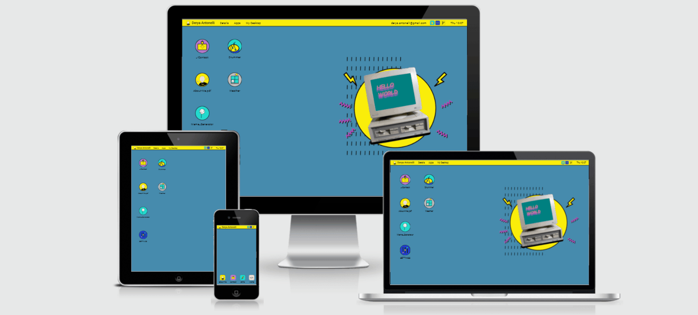
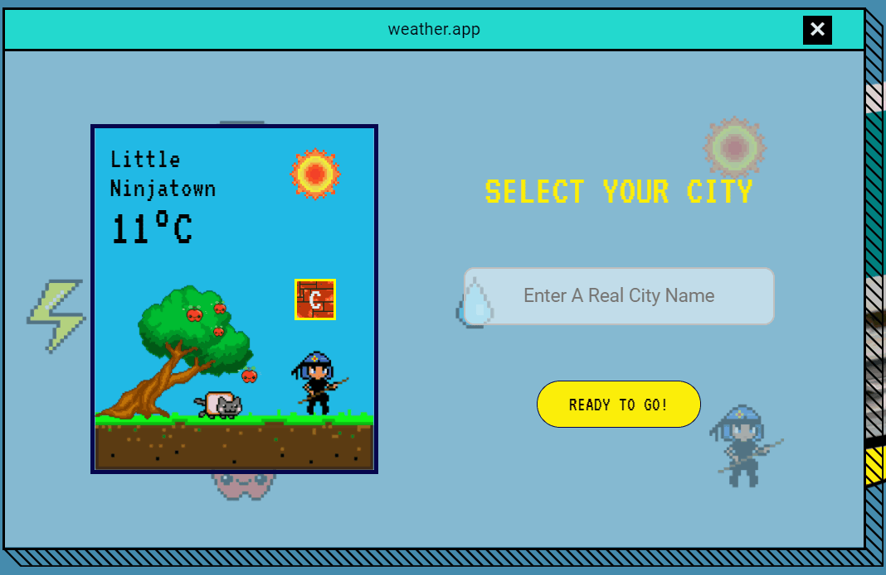
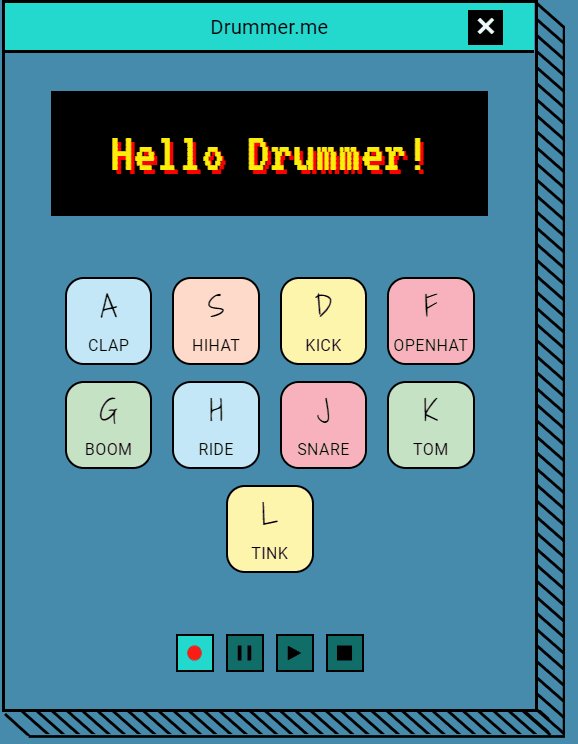
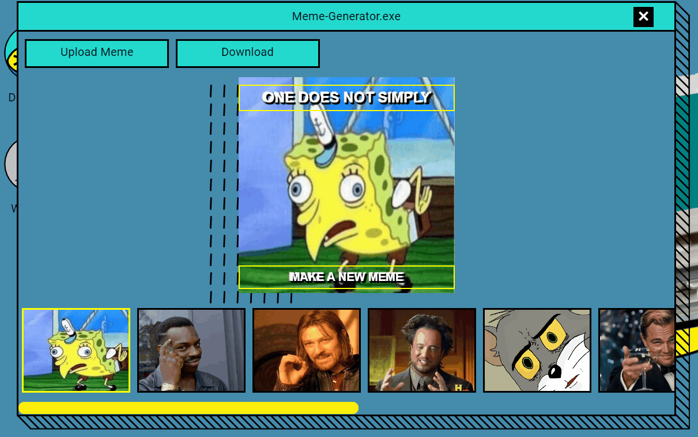
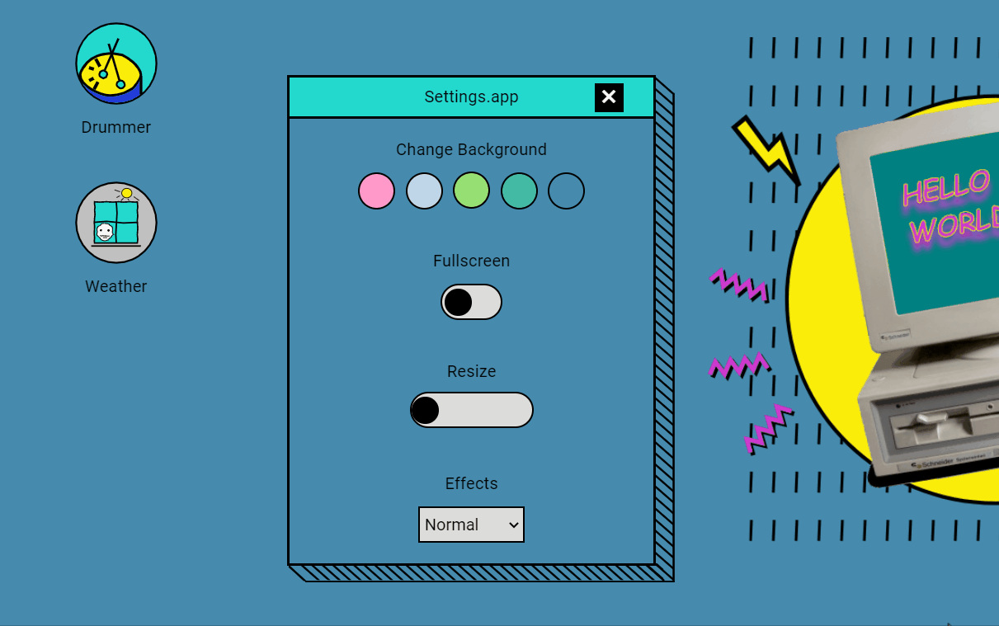

# :zap: My Personal Portfolio Website :zap: ##

#### Table of Contents

<!--ts-->
* [About](#About)
  * [Screenshots & Gifs](#Screenshots-&-Gifs)
  * [Improvements](#Improvements)
  * [Things I'd Do in a Different Way](#Things-I'd-Do-in-a-Different-Way)
* [Technologies](#Technologies)
  * [Front-end](#Front-end)
  * [API's](#API's)
  * [Design](#Design)
  * [Test](#Test)

<!--te-->

## About

This is a retro-inspired, responsive website with client-side applications and my portfolio.    

### Screenshots & Gifs
#### Main Page

#### Weather App

#### Drummer App

#### Meme Generator

#### Settings

### Improvements

- Performance: Initially I've preferred SVG and PNG format over JPEG because I've adopted desktop-first strategy, which means images need to be sharp across widescreen and high-resolution devices with varying width. But this came with a price: images with large size resulted in a low-performace score due to their effect on the first contentful paint (FCP). To optimize user experience, I've switched image formats into WEBP in supported devices, plus I've utilized online tools such as [compressor.io](https://compressor.io/) to compress images. After that, I've improved my performance score by %20.

- Responsiveness: Adapting my website design to mobile devices had been a problem as this project was originally born out of the idea that users feel as if they navigate on my desktop. In addition, I do not want to welcome mobile visitors with a message saying "hey, just visit my website on desktop!". To solve this issue, I came out with a fresh design approach and switched desktop layout to a simplified mobile home screen layout for mobile users.

- Accessibility: I've added keyboard control to the weather application to improve the experience for users that aren't using a mouse. Users can navigate to suggested locations with arrow buttons and press search with enter key. 

- CI: I automated dependency upgrades using Dependabot. 

- Security: Utilized a simple cloud function to hide Open Weather API key.

### Things I'd Do in a Different Way
If I started this project now, I'd do these: 

- Software Design: Before starting out this project, I'd carefully plan my design approach, responsiveness, performance issues, accessibility, target browsers and project structure.

- Documentation: I'd start documenting my project just after writing my first line of code! 

- Libraries: React would be a right choice to work with for creating reusable components and well-organized code. 

## Technologies

### Front-end
JavaScript, CSS, HTML

### API's
Web Audio API, Media Recorder API, Open Weather API

### Design
Adobe XD

### Test
BrowserStack, Google Dev Tools

